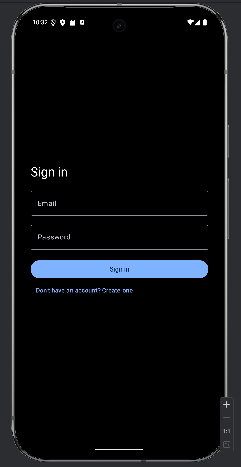
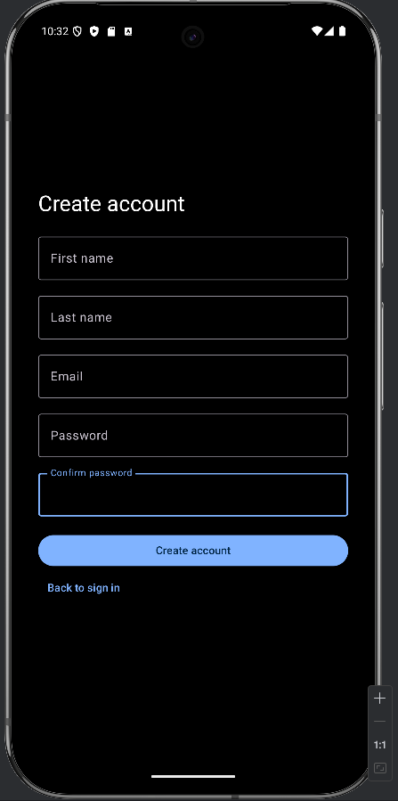
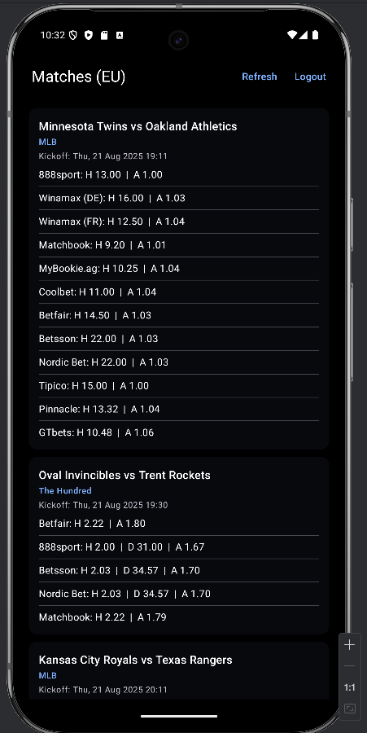

# WWOdds (Android)

An Android app for browsing sports betting odds, focused on **EU region** data. The app is built with **Kotlin** and **Jetpack Compose**, follows a **minimal MVVM** approach, and communicates with a REST backend via **Retrofit/OkHttp**. The UI is intentionally simple and dark-themed to keep the focus on content.

## Highlights
- **Authentication**: Register (firstName, lastName, email, password) and Sign in.
- **Region**: Client is locked to **EU** — registration always sends `regions: ["eu"]`, and the odds screen consumes only the `eu` node from `/odds`.
- **Odds list**: Each match shows `HomeTeam vs AwayTeam`, kickoff time, and H/D/A odds per bookmaker (first available H2H market).
- **Session**: JWT token stored **in memory** (no persistence) and attached to requests via `Authorization` header
- **UI**: Compose Material 3, dark palette (black surfaces, white text)

## Architecture (brief)
- **MVVM**: `ViewModel` (state + coroutines) → `Repository` (network) → `Retrofit API`.
- **Modules**:
  - `data/auth`: `AuthApi`, models (login/register/token), `AuthRepository`, `Network` (Retrofit/OkHttp), `Session` (RAM token).
  - `data/odds`: `OddsApi`, models (events, bookmakers, markets, outcomes), `OddsRepository` (EU-only).
  - `ui`: `HomeViewModel`, screens (`Login`, `Register`, `Home`), simple dark **Theme**.
- **Navigation**: Navigation Compose (`login` → `home`, `register` → `home`, `logout` → `login`).

## Data Flow
`Login/Register` → receive `{ token }` → store in `Session` → interceptor adds `Authorization: <token>` → `GET /odds` → use only `eu` → render list with titles, kickoff, and H/D/A per bookmaker.

## Client-Side API (expected)
- `POST /register` → body: `{ firstName, lastName, email, password, regions: ["eu"] }` → response: `{ token }`
- `POST /login` → body: `{ email, password }` → response: `{ token }`
- `GET /odds` → response: map of regions; the app uses only `eu: [ EventDto ]`
  - Event fields used: `sport_title`, `home_team`, `away_team`, `commence_time`, and `bookmakers[].markets[key="h2h"].outcomes` (H/D/A).

## Screens
**Login**: Email & Password; errors inline; link to Register.

**Register**: First/Last/Email/Password/Confirm; region is implicit (EU).

**Home**: EU matches list with kickoff time and H/D/A odds per bookmaker; Refresh & Logout in the app bar.

## Current Limitations
- Session is not persisted (token cleared on app restart).
- EU-only; no league/sport filters or pagination.
- No “best odds” aggregation across bookmakers (first available H2H is shown).

## Roadmap (nice-to-have)
- Persist session (DataStore), filters/search, pagination.
- Best-odds aggregation, offline/empty-state improvements, richer theming.